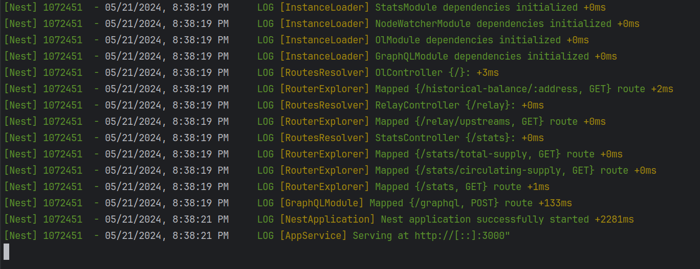
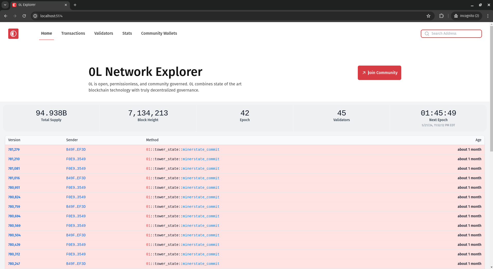

# 0L Explorer

The 0L explorer lives at [0l.fyi](https://0l.fyi/).

## Project management

The project is hosted on [GitLab](https://gitlab.com/0lfyi/explorer/).

## Feature requests

[Feature Requests](https://gitlab.com/0lfyi/explorer/-/issues/?label_name%5B%5D=feature-request)

[Request a new feature](https://gitlab.com/0lfyi/explorer/-/issues/new?issuable_template=Feature%20Request)

# Structure of this repo:

This repository contains the code for the 0L Network explorer and is
structured in the following way:

- `api`: This directory contains the backend in `Nest.js`, the source for `transformer` binary
  and the required migration files.
- `infra`: This directory contains the K8s YAML files for deployment on K8s.
- `ol-fyi-local-infra`: This directory contains files for setting up the databased locally using docker-compose.
- `web-app`: This directory contains the client-side code for the 0L Explorer app.


# Local Setup:

This documentation will walk you through setting up and running the Wallet Explorer project locally from scratch. Follow these steps carefully to ensure a smooth setup process:

Prerequisites
--------------

Before you begin, ensure you have the following installed on your system:

1. Docker: [Install Docker](https://docs.docker.com/get-docker/)
2. Docker Compose: [Install Docker Compose](https://docs.docker.com/compose/install/)
3. Node.js and npm: [Install Node.js](https://nodejs.org/en/download/)
4. Rust and Cargo: [Install Rust](https://www.rust-lang.org/tools/install)

Once you are set, follow the steps:

- First, set up all the necessary components using Docker Compose.

- Navigate to the `ol-fyi-local-infra` directory.

   ```bash
   $ cd /explorer/ol-fyi-local-infra
   ```


- Once you are in the `ol-fyi-local-infra` directory, run:

   ```bash
  $  docker compose up -d
   ```

This brings all the databases up:

- Redis
- Clickhouse
- NATS
- Postgres

Check the status using:

```bash
$ docker ps
```

Running Clickhouse Migrations
------------------------------

Once the Clickhouse database is up and running,
you can connect to it using:

```bash 
$ docker exec -it ol-fyi-local-infra_clickhouse_1 bash
```

Once, inside the container's shell, execute:

```bash
$ clickhouse client -h "127.0.0.1" --port 9000 -u "olfyi" --password "olfyi" -d "olfyi" -n
```

After connecting to the clickhouse client, execute the queries to
run the migrations stored in the `tables_local.sql` file manually.

Building the Transformer Binary
---------------------------------

Navigate to the transformer directory and build the project:

```bash 
$ cd explorer/api/transformer
```

Build the binary:

```bash 
$ cargo build
```

Copy the binary to /usr/local/bin:

```bash 
$ sudo cp /target/debug/build/transformer /usr/local/bin/
```

Make the binary executable:

```bash 
$ sudo chmod +x /usr/local/bin/transformer
```

Run the backend
----------------

Navigate to `api` directory.

```bash
$ cd api
```

## PostgreSQL

We use (Primsa)[https://www.prisma.io/].

- Run `npx prisma generate` if you update `api/prisma/schema.prisma`.
- Run `npx prisma db push` to migrate the database.


## Installation

First, install the project dependencies:

```bash
$ npm install
```

Don't forget to configure the `.env` on your machine

```bash
$ cp .env.example .env
```

## Running the app

To run your Nest application, use the following commands:

```bash
# development
$ npm run start

# watch mode
$ npm run start:dev

# production mode
$ npm run start:prod
```

## Test

Execute the unit and e2e tests to ensure your application is running correctly:

```bash
# unit tests
$ npm run test

# e2e tests
$ npm run test:e2e

# test coverage
$ npm run test:cov
```

This will run the backend as shown:




Run the client:
----------------

Once the backend is running, run the client,

```bash
$ cd web-app
```

First, install the project dependencies:

```bash
$ npm install
```

And run it with:

```bash
$ npm run dev
```

This will run the client as shown:


